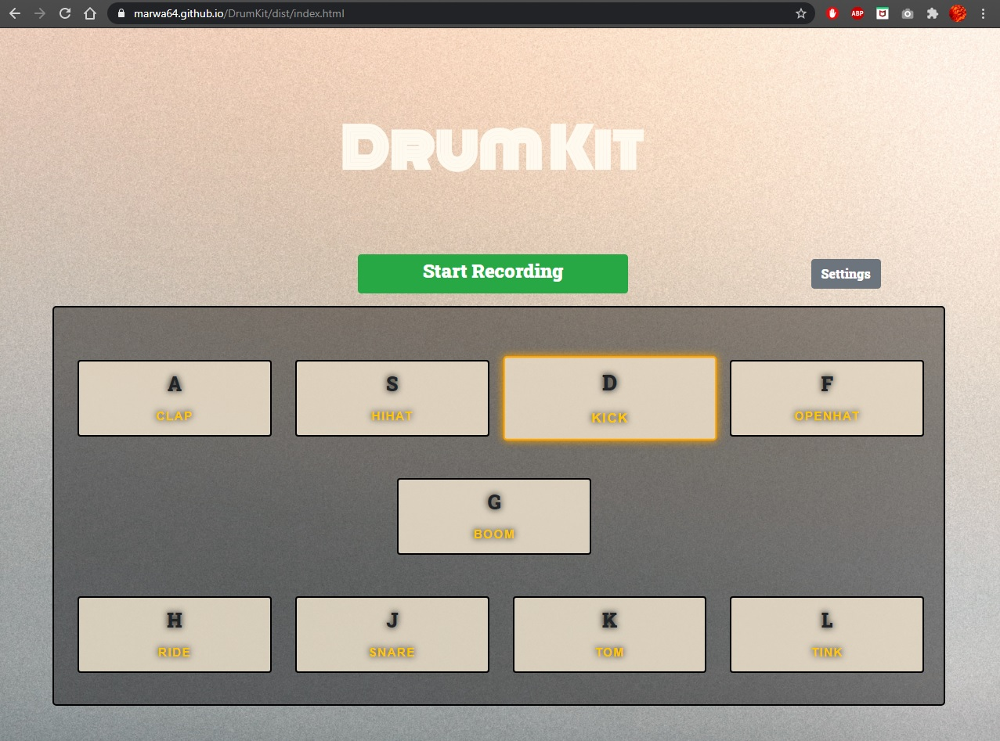

<h1>Drum Kit</h1>
Live version: https://marwa64.github.io/DrumKit/dist/index.html  

This is a simple drum that you can play using your keyboard or mouse, each key makes a different sound from the drum

<h3>Features</h3>
<ul>
  <li>Custom Sound
    
 You can go to the settings and add your own audio file into any of the keys

  </li>
  <li>Record Audio
    
 You can record the audio of what you're playing and once you stop an audio file should automatically be downloaded

  </li>
</ul>
<h3>Screen Shots</h3>
  
  
  
